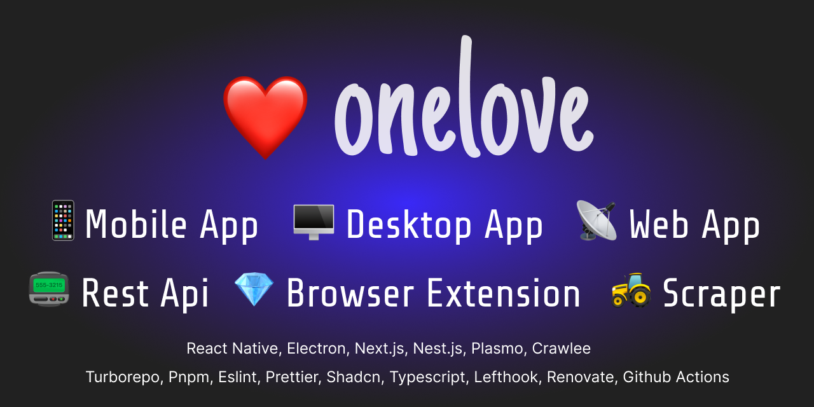
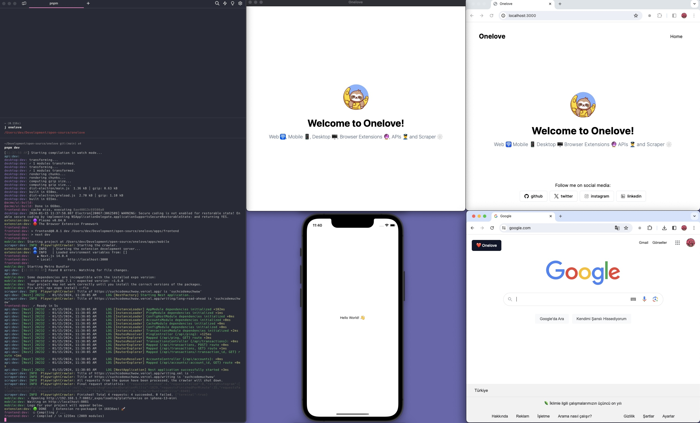

# onelove 🫶

<div style="display:flex;">
    
</div>

## 🚀 Motivation

As a creator and relentless dreamer, navigating the intricate process of crafting complete products felt overwhelming. Developing frontend, backend, mobile, Scraper, and various components for each repository seemed like a series of separate battles and redundant efforts. I envisioned a space where the challenges of developing entire products could be addressed directly. A place where collaboration flowed naturally, contracts seamlessly, and tooling was a boon rather than a necessary evil.

## 🎯 Goals
- **Technology Agnostic:** Use your preferred tech stack - be it Vercel, GCP, AWS, Supabase, Firebase, Prisma, Drizzle, etc.
- **Ease of Use:** No boilerplate code, no unnecessary folder structures - just simplicity.
- **Frameworks with Community Support:** Leverage widely-used frameworks with large communities such as Next.js, Nest.js, React Native, Electron, Playwright, and Plasmo.

## 📚 Table of Contents

- [Getting Started](#getting-started)
- [Motivation](#motivation)
- [What's Inside](#whats-inside)
- [Dependencies](#dependencies)
- [Running e2e Tests](#running-e2e-tests)
- [Changelog](#changelog)
- [Contributing](#contributing)
- [License](#license)

## 🚀 Getting Started

**Step 1:** The easiest way to get started is to clone the repository:

```bash
# Get the latest snapshot
git clone https://github.com/suchcodemuchwow/onelove.git myproject

# Change directory
cd myproject

# Install NPM dependencies
pnpm install

# Then simply start your app
pnpm dev
```

## 📦 What's Inside?

This Turborepo includes the following packages/apps:

<div style="display:flex;">
    
</div>

#### Apps

- `frontend`: a [Next.js](https://nextjs.org/) app
- `api`: a [Nest.js](https://nestjs.com/) api
- `mobile`: a [React Native-Expo](https://expo.dev/) app
- `extension`: a [Plasmo](https://www.plasmo.com/) browser extension
- `desktop`: an [Electron](http://electron.atom.io/) app
- `scraper`: a [Playwright](https://playwright.dev/) app

#### Packages

- `@acme/ui`: [Shadcn](https://ui.shadcn.com/) ui library
- `@acme/eslint-config`: `eslint` configurations
- `@acme/typescript-config`: `tsconfig.json`s used throughout the monorepo

#### Utilities

This Turborepo has some additional tools already set up for you:

- [TypeScript](https://www.typescriptlang.org/) for static type checking
- [ESLint](https://eslint.org/) for code linting
- [Prettier](https://prettier.io) for code formatting
- [Renovate](https://docs.renovatebot.com) for dependency updates
- [Lefthook](https://github.com/evilmartians/lefthook) for git hooks

## 🛠️ Dependencies
| Package                                    | Description                                                             |
| ------------------------------------------ | ----------------------------------------------------------------------- |
| **crawlee**                                | Web scraping library.                                                   |
| **electron**                               | Cross-platform desktop application framework.                           |
| **eslint**                                 | JavaScript and TypeScript code quality checker.                         |
| **expo**                                   | Framework for building universal native apps.                           |
| **jest**                                   | JavaScript testing framework.                                           |
| **lefthook**                               | Git hooks manager.                                                      |
| **next**                                   | React framework for static websites.                                    |
| **playwright**                             | Node library to automate browsers.                                      |
| **plasmo**                                 | Browser extension framework.                                            |
| **prettier**                               | Opinionated code formatter.                                             |
| **react**                                  | JavaScript library for building user interfaces.                        |
| **react-native**                           | Framework for building native apps using React.                         |
| **react-native-web**                       | React Native for the web.                                               |
| **tailwindcss**                            | Utility-first CSS framework.                                            |
| **turbo**                                  | High-performance build system for JavaScript and TypeScript.            |
| **typescript**                             | TypeScript language.                                                    |
| **vite**                                   | Fast development server and build tool.                                 |
| @babel/core                                | Babel compiler core.                                                    |
| @ianvs/prettier-plugin-sort-imports        | Prettier plugin for sorting imports.                                    |
| @nestjs/cache-manager                      | NestJS cache manager.                                                   |
| @nestjs/cli                                | NestJS command line interface.                                          |
| @nestjs/common                             | NestJS common utilities and decorators.                                 |
| @nestjs/config                             | NestJS configuration module.                                            |
| @nestjs/core                               | NestJS core framework.                                                  |
| @nestjs/platform-express                   | NestJS HTTP server platform.                                            |
| @nestjs/schematics                         | NestJS schematics.                                                      |
| @nestjs/swagger                            | NestJS OpenAPI (Swagger) integration.                                   |
| @next/eslint-plugin-next                   | ESLint plugin for Next.js.                                              |
| @plasmohq/messaging                        | PlasmoHQ messaging library.                                             |
| @plasmohq/prettier-plugin-sort-imports     | Prettier plugin for sorting imports (PlasmoHQ version).                 |
| @typescript-eslint/eslint-plugin           | TypeScript ESLint plugin.                                               |
| @typescript-eslint/parser                  | TypeScript ESLint parser.                                               |
| @vitejs/plugin-react                       | Vite plugin for React.                                                  |
| autoprefixer                               | PostCSS plugin to parse CSS and add vendor prefixes.                    |
| babel-preset-expo                          | Babel preset for Expo projects.                                         |
| cache-manager                              | Generic caching module for Node.js.                                     |
| class-transformer                          | Decorator-based object transformation library.                          |
| class-validator                            | Validator and sanitizer for classes.                                    |
| electron-builder                           | Create installers for Electron apps.                                    |
| eslint-config-prettier                     | ESLint configuration for Prettier.                                      |
| eslint-config-turbo                        | Turbo's ESLint configuration.                                           |
| eslint-plugin-import                       | ESLint plugin for import/export syntax.                                 |
| eslint-plugin-jsx-a11y                     | ESLint plugin for JSX accessibility rules.                              |
| eslint-plugin-react                        | ESLint plugin for React.                                                |
| eslint-plugin-react-hooks                  | ESLint plugin for React Hooks.                                          |
| expo-dev-client                            | Expo development client.                                                |
| expo-status-bar                            | Expo status bar component.                                              |
| expo-updates                               | Expo updates module.                                                    |
| lucide-react                               | SVG icon component library.                                             |
| postcss                                    | Tool for transforming styles with JS plugins.                           |
| prettier-plugin-tailwindcss                | Prettier plugin for Tailwind CSS.                                       |
| react-dom                                  | Entry point to the DOM and server renderers for React.                  |
| react-router-dom                           | Declarative routing for React.js.                                       |
| reflect-metadata                           | Decorator metadata reflection library.                                  |
| rxjs                                       | Reactive programming library.                                           |
| source-map-support                         | Adds source map support to Node.js.                                     |
| supertest                                  | HTTP assertion library for testing Node.js HTTP servers.                |
| tailwind-merge                             | Tailwind CSS utility for merging configurations.                        |
| tailwindcss-animate                        | Tailwind CSS plugin for animations.                                     |
| ts-jest                                    | Jest preprocessor for TypeScript.                                       |
| ts-loader                                  | TypeScript loader for webpack.                                          |
| ts-node                                    | TypeScript execution environment for Node.js.                           |
| tsconfig-paths                             | Resolve TypeScript module aliases.                                      |
| tsup                                       | TypeScript module bundler.                                              |
| tsx                                        | TypeScript React JSX support.                                           |
| vite-plugin-electron                       | Vite plugin for Electron.                                               |
| vite-plugin-electron-renderer              | Vite plugin for Electron renderer.                                      |

## 🧪 Running e2e Tests
To run e2e tests for mobile, ensure you have the following installed:

```bash
# Install applesimutils
brew tap wix/brew
brew install applesimutils
```

Please run the mobile app the first time you start using the repository; otherwise, Detox may not find the app.

## 📝 Todo
- [ ] Shared types package

## 📜 Changelog
Check out the changelog for the project [here](https://github.com/suchcodemuchwow/onelove/blob/main/CHANGELOG.md).

## 🤝 Contributing
If something is unclear, confusing, or needs refactoring, please let me know. Pull requests are always welcome. Please open an issue before submitting a pull request. This project adheres to the [Airbnb JavaScript Style Guide](https://github.com/airbnb/javascript) with a few minor exceptions.

## 📄 License
Copyright (c) 2023-2024 suchcodemuchwow

Permission is hereby granted, free of charge, to any person obtaining a copy of this software and associated documentation files (the "Software"), to deal in the Software without restriction, including without limitation the rights to use, copy, modify, merge, publish, distribute, sublicense, and/or sell copies of the Software, and to permit persons to whom the Software is furnished to do so, subject to the following conditions:

The above copyright notice and this permission notice shall be included in all copies or substantial portions of the Software.

THE SOFTWARE IS PROVIDED "AS IS," WITHOUT WARRANTY OF ANY KIND, EXPRESS OR IMPLIED, INCLUDING BUT NOT LIMITED TO THE WARRANTIES OF MERCHANTABILITY, FITNESS FOR A PARTICULAR PURPOSE, AND NONINFRINGEMENT. IN NO EVENT SHALL THE AUTHORS OR COPYRIGHT HOLDERS BE LIABLE FOR ANY CLAIM, DAMAGES, OR OTHER LIABILITY, WHETHER IN AN ACTION OF CONTRACT, TORT, OR OTHERWISE, ARISING FROM, OUT OF, OR IN CONNECTION WITH THE SOFTWARE OR THE USE OR OTHER DEALINGS IN THE SOFTWARE.